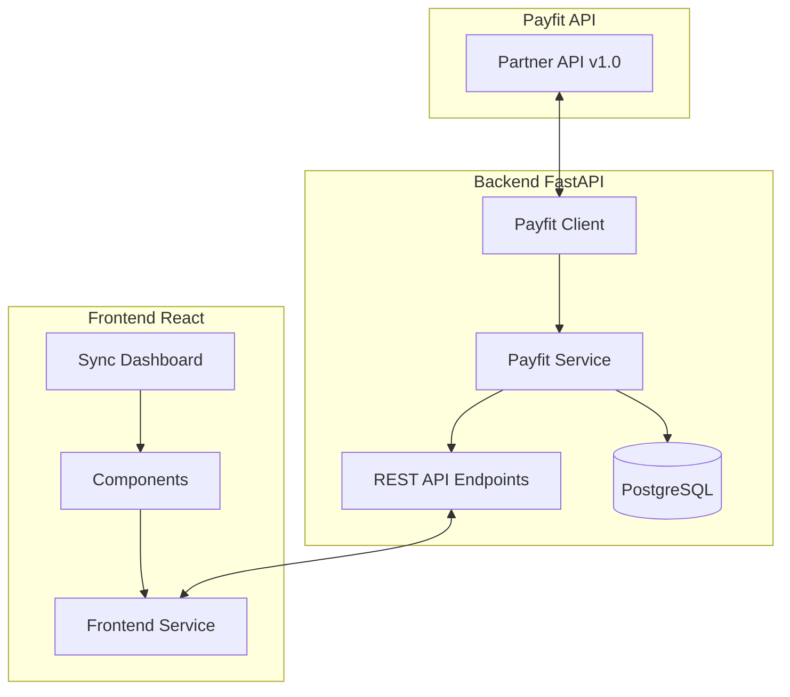

# PRD : Synchronisation Payfit - Plan Charge v11b
## Product Requirements Document

### Date : Décembre 2024
### Version : 1.0
### Statut : 🟢 ACTIF

---

## 1. Executive Summary

### 1.1 Contexte
Plan Charge v11b nécessite une intégration complète avec Payfit pour synchroniser automatiquement les données RH (employés, absences, contrats). Cette intégration permettra de maintenir une base de données à jour sans saisie manuelle.

### 1.2 Objectifs
- **Automatisation** : Éliminer la saisie manuelle des données RH
- **Fiabilité** : Données toujours à jour depuis Payfit (source de vérité)
- **Traçabilité** : Historique complet des synchronisations
- **Performance** : Synchronisation incrémentale et optimisée

### 1.3 Périmètre
- ✅ Synchronisation des employés/collaborateurs
- ✅ Synchronisation des absences (congés, RTT, maladie)
- ✅ Synchronisation des contrats de travail
- ❌ Télétravail (non disponible dans l'API Payfit actuelle)

---

## 2. Architecture Technique

### 2.1 Vue d'ensemble



### 2.2 Stack Technique
- **Backend** : FastAPI 0.104+, Python 3.11+
- **Frontend** : React 18, TypeScript 5, Tailwind CSS
- **Base de données** : PostgreSQL 14+
- **API externe** : Payfit Partner API v1.0
- **Authentication** : Bearer Token (OAuth2)

### 2.3 Configuration

```env
# Payfit API Configuration
PAYFIT_API_URL=https://partner-api.payfit.com
PAYFIT_API_KEY=customer-Z3R+T7v/J6WZYyhUfsUfBAPcex3JKP0xoYBxj8GGKpM=
PAYFIT_COMPANY_ID=605b04c20e572063612a11ef
PAYFIT_USE_MOCK=false
```

---

## 3. Modèles de Données

### 3.1 Schéma de Base de Données

```sql
-- Table des employés Payfit
CREATE TABLE payfit_employees (
    id UUID PRIMARY KEY DEFAULT gen_random_uuid(),
    payfit_id VARCHAR(255) UNIQUE NOT NULL,
    email VARCHAR(255) NOT NULL,
    first_name VARCHAR(100),
    last_name VARCHAR(100),
    registration_number VARCHAR(50),  -- Matricule
    birth_date DATE,
    gender VARCHAR(20),
    nationality VARCHAR(10),
    
    -- Work info
    department VARCHAR(255),
    position VARCHAR(255),
    hire_date DATE,
    termination_date DATE,
    manager_id VARCHAR(255),
    team_name VARCHAR(100),
    
    -- Link to local user
    local_user_id UUID REFERENCES users(id),
    
    -- Metadata
    is_active BOOLEAN DEFAULT true,
    metadata_json JSONB DEFAULT '{}',
    last_synced_at TIMESTAMP WITH TIME ZONE,
    created_at TIMESTAMP WITH TIME ZONE DEFAULT CURRENT_TIMESTAMP,
    updated_at TIMESTAMP WITH TIME ZONE DEFAULT CURRENT_TIMESTAMP
);

-- Table des absences Payfit
CREATE TABLE payfit_absences (
    id UUID PRIMARY KEY DEFAULT gen_random_uuid(),
    payfit_id VARCHAR(255) UNIQUE NOT NULL,
    employee_id UUID REFERENCES payfit_employees(id),
    contract_id VARCHAR(255),
    
    -- Dates
    start_date DATE NOT NULL,
    start_moment VARCHAR(20),  -- 'beginning-of-day', 'end-of-day'
    end_date DATE NOT NULL,
    end_moment VARCHAR(20),
    
    -- Type and status
    absence_type VARCHAR(100) NOT NULL,  -- 'fr_conges_payes', 'fr_rtt', etc.
    status VARCHAR(50) NOT NULL,  -- 'approved', 'pending_approval', etc.
    
    -- Calculated fields
    duration_days DECIMAL(10,2),
    working_days DECIMAL(10,2),
    
    -- Metadata
    metadata_json JSONB DEFAULT '{}',
    created_at TIMESTAMP WITH TIME ZONE DEFAULT CURRENT_TIMESTAMP,
    updated_at TIMESTAMP WITH TIME ZONE DEFAULT CURRENT_TIMESTAMP
);

-- Table des contrats Payfit
CREATE TABLE payfit_contracts (
    id UUID PRIMARY KEY DEFAULT gen_random_uuid(),
    payfit_id VARCHAR(255) UNIQUE NOT NULL,
    employee_id UUID REFERENCES payfit_employees(id),
    
    -- Contract details
    start_date DATE NOT NULL,
    end_date DATE,
    status VARCHAR(50) NOT NULL,  -- 'ACTIVE', 'ARCHIVED'
    job_name VARCHAR(255),
    
    -- Working time
    standard_weekly_hours DECIMAL(10,2),
    full_time_equivalent DECIMAL(10,2),
    is_full_time BOOLEAN,
    
    -- Metadata
    metadata_json JSONB DEFAULT '{}',
    created_at TIMESTAMP WITH TIME ZONE DEFAULT CURRENT_TIMESTAMP,
    updated_at TIMESTAMP WITH TIME ZONE DEFAULT CURRENT_TIMESTAMP
);

-- Table des logs de synchronisation
CREATE TABLE payfit_sync_logs (
    id UUID PRIMARY KEY DEFAULT gen_random_uuid(),
    sync_type VARCHAR(50) NOT NULL,  -- 'employees', 'absences', 'contracts', 'complete'
    sync_status VARCHAR(50) NOT NULL,  -- 'started', 'completed', 'failed'
    started_at TIMESTAMP WITH TIME ZONE NOT NULL,
    completed_at TIMESTAMP WITH TIME ZONE,
    
    -- Statistics
    records_synced INTEGER DEFAULT 0,
    records_created INTEGER DEFAULT 0,
    records_updated INTEGER DEFAULT 0,
    records_failed INTEGER DEFAULT 0,
    
    -- Error tracking
    error_message TEXT,
    error_details JSONB,
    
    -- Metadata
    metadata_json JSONB DEFAULT '{}',
    created_at TIMESTAMP WITH TIME ZONE DEFAULT CURRENT_TIMESTAMP
);
```

### 3.2 Modèles Pydantic

```python
# schemas/payfit.py
from pydantic import BaseModel, EmailStr
from datetime import date, datetime
from typing import Optional, List, Dict, Any
from uuid import UUID

class PayfitEmployeeBase(BaseModel):
    payfit_id: str
    email: EmailStr
    first_name: str
    last_name: str
    registration_number: Optional[str] = None
    
class PayfitEmployeeCreate(PayfitEmployeeBase):
    pass

class PayfitEmployee(PayfitEmployeeBase):
    id: UUID
    local_user_id: Optional[UUID] = None
    is_active: bool
    created_at: datetime
    updated_at: datetime
    
    class Config:
        from_attributes = True

class PayfitAbsenceBase(BaseModel):
    payfit_id: str
    start_date: date
    end_date: date
    absence_type: str
    status: str
    
class PayfitAbsence(PayfitAbsenceBase):
    id: UUID
    employee_id: UUID
    duration_days: Optional[float] = None
    working_days: Optional[float] = None
    created_at: datetime
    
    class Config:
        from_attributes = True

class PayfitContractBase(BaseModel):
    payfit_id: str
    start_date: date
    end_date: Optional[date] = None
    status: str
    job_name: Optional[str] = None
    
class PayfitContract(PayfitContractBase):
    id: UUID
    employee_id: UUID
    standard_weekly_hours: Optional[float] = None
    full_time_equivalent: Optional[float] = None
    is_full_time: Optional[bool] = None
    created_at: datetime
    
    class Config:
        from_attributes = True

class SyncStatusResponse(BaseModel):
    last_sync: Optional[datetime] = None
    status: str
    employees_count: int
    absences_count: int
    contracts_count: int
    last_error: Optional[str] = None

class SyncTriggerResponse(BaseModel):
    sync_id: UUID
    status: str = "started"
    message: str
```

---

## 4. Services Backend

### 4.1 Client API Payfit

```python
# services/payfit_client.py
import httpx
from typing import List, Optional, Dict, Any
from datetime import date
import logging
from app.core.config import settings

logger = logging.getLogger(__name__)

class PayfitClient:
    """Client pour l'API Payfit Partner"""
    
    def __init__(self):
        self.base_url = settings.PAYFIT_API_URL
        self.company_id = settings.PAYFIT_COMPANY_ID
        self.headers = {
            "Authorization": f"Bearer {settings.PAYFIT_API_KEY}",
            "Accept": "application/json",
            "Content-Type": "application/json"
        }
        
    async def get_company(self) -> Dict[str, Any]:
        """Récupérer les informations de l'entreprise"""
        async with httpx.AsyncClient() as client:
            response = await client.get(
                f"{self.base_url}/companies/{self.company_id}",
                headers=self.headers
            )
            response.raise_for_status()
            return response.json()
    
    async def get_contracts(self, 
                          page_token: Optional[str] = None,
                          limit: int = 50) -> Dict[str, Any]:
        """Récupérer la liste des contrats"""
        params = {"limit": limit}
        if page_token:
            params["pageToken"] = page_token
            
        async with httpx.AsyncClient() as client:
            response = await client.get(
                f"{self.base_url}/companies/{self.company_id}/contracts",
                headers=self.headers,
                params=params
            )
            response.raise_for_status()
            return response.json()
    
    async def get_absences(self,
                          begin_date: Optional[date] = None,
                          end_date: Optional[date] = None,
                          status: str = "approved",
                          page_token: Optional[str] = None,
                          limit: int = 50) -> Dict[str, Any]:
        """Récupérer la liste des absences"""
        params = {
            "limit": limit,
            "status": status
        }
        if begin_date:
            params["beginDate"] = begin_date.isoformat()
        if end_date:
            params["endDate"] = end_date.isoformat()
        if page_token:
            params["pageToken"] = page_token
            
        async with httpx.AsyncClient() as client:
            response = await client.get(
                f"{self.base_url}/companies/{self.company_id}/absences",
                headers=self.headers,
                params=params
            )
            response.raise_for_status()
            return response.json()
```

### 4.2 Service de Synchronisation

```python
# services/payfit_service.py
from typing import Dict, List, Optional
from datetime import datetime, date, timedelta
from sqlalchemy.ext.asyncio import AsyncSession
from sqlalchemy import select
import logging
import uuid

from app.models.payfit import (
    PayfitEmployee, PayfitAbsence, 
    PayfitContract, PayfitSyncLog
)
from app.models.user import User
from app.services.payfit_client import PayfitClient

logger = logging.getLogger(__name__)

class PayfitService:
    """Service de synchronisation Payfit"""
    
    def __init__(self, db: AsyncSession):
        self.db = db
        self.client = PayfitClient()
    
    async def sync_employees(self) -> Dict[str, int]:
        """Synchroniser les employés depuis Payfit"""
        sync_log = PayfitSyncLog(
            id=uuid.uuid4(),
            sync_type="employees",
            sync_status="started",
            started_at=datetime.utcnow()
        )
        self.db.add(sync_log)
        await self.db.commit()
        
        try:
            created = updated = failed = 0
            page_token = None
            
            while True:
                # Récupérer les contrats (qui contiennent les infos employés)
                data = await self.client.get_contracts(page_token=page_token)
                contracts = data.get("contracts", [])
                
                for contract_data in contracts:
                    try:
                        # Extraire les infos employé
                        payfit_id = contract_data["collaboratorId"]
                        
                        # Vérifier si l'employé existe
                        result = await self.db.execute(
                            select(PayfitEmployee).where(
                                PayfitEmployee.payfit_id == payfit_id
                            )
                        )
                        employee = result.scalar_one_or_none()
                        
                        if employee:
                            # Mettre à jour
                            employee.first_name = contract_data.get("firstName")
                            employee.last_name = contract_data.get("lastName")
                            employee.updated_at = datetime.utcnow()
                            updated += 1
                        else:
                            # Créer
                            employee = PayfitEmployee(
                                id=uuid.uuid4(),
                                payfit_id=payfit_id,
                                email=f"{contract_data.get('firstName', '').lower()}.{contract_data.get('lastName', '').lower()}@company.com",
                                first_name=contract_data.get("firstName"),
                                last_name=contract_data.get("lastName"),
                                is_active=contract_data.get("status") == "ACTIVE"
                            )
                            self.db.add(employee)
                            created += 1
                            
                        # Essayer de lier avec un utilisateur local
                        await self._link_to_local_user(employee)
                        
                    except Exception as e:
                        logger.error(f"Error syncing employee: {e}")
                        failed += 1
                
                # Pagination
                page_token = data.get("meta", {}).get("nextPageToken")
                if not page_token:
                    break
            
            # Mettre à jour le log
            sync_log.sync_status = "completed"
            sync_log.completed_at = datetime.utcnow()
            sync_log.records_created = created
            sync_log.records_updated = updated
            sync_log.records_failed = failed
            sync_log.records_synced = created + updated
            
            await self.db.commit()
            
            return {
                "created": created,
                "updated": updated,
                "failed": failed,
                "total": created + updated
            }
            
        except Exception as e:
            sync_log.sync_status = "failed"
            sync_log.completed_at = datetime.utcnow()
            sync_log.error_message = str(e)
            await self.db.commit()
            raise
    
    async def sync_absences(self, 
                           begin_date: Optional[date] = None,
                           end_date: Optional[date] = None) -> Dict[str, int]:
        """Synchroniser les absences depuis Payfit"""
        # Si pas de dates, prendre les 3 derniers mois et les 3 prochains
        if not begin_date:
            begin_date = date.today() - timedelta(days=90)
        if not end_date:
            end_date = date.today() + timedelta(days=90)
            
        sync_log = PayfitSyncLog(
            id=uuid.uuid4(),
            sync_type="absences",
            sync_status="started",
            started_at=datetime.utcnow(),
            metadata_json={
                "begin_date": begin_date.isoformat(),
                "end_date": end_date.isoformat()
            }
        )
        self.db.add(sync_log)
        await self.db.commit()
        
        try:
            created = updated = failed = 0
            page_token = None
            
            while True:
                data = await self.client.get_absences(
                    begin_date=begin_date,
                    end_date=end_date,
                    page_token=page_token
                )
                absences = data.get("absences", [])
                
                for absence_data in absences:
                    try:
                        payfit_id = absence_data["id"]
                        
                        # Vérifier si l'absence existe
                        result = await self.db.execute(
                            select(PayfitAbsence).where(
                                PayfitAbsence.payfit_id == payfit_id
                            )
                        )
                        absence = result.scalar_one_or_none()
                        
                        # Trouver l'employé
                        employee_result = await self.db.execute(
                            select(PayfitEmployee).where(
                                PayfitEmployee.payfit_id == absence_data["contractId"]
                            )
                        )
                        employee = employee_result.scalar_one_or_none()
                        
                        if not employee:
                            logger.warning(f"Employee not found for absence {payfit_id}")
                            failed += 1
                            continue
                        
                        # Parser les dates
                        start_date = datetime.fromisoformat(
                            absence_data["startDate"]["date"]
                        ).date()
                        end_date = datetime.fromisoformat(
                            absence_data["endDate"]["date"]
                        ).date()
                        
                        if absence:
                            # Mettre à jour
                            absence.start_date = start_date
                            absence.end_date = end_date
                            absence.status = absence_data["status"]
                            absence.updated_at = datetime.utcnow()
                            updated += 1
                        else:
                            # Créer
                            absence = PayfitAbsence(
                                id=uuid.uuid4(),
                                payfit_id=payfit_id,
                                employee_id=employee.id,
                                contract_id=absence_data["contractId"],
                                start_date=start_date,
                                start_moment=absence_data["startDate"]["moment"],
                                end_date=end_date,
                                end_moment=absence_data["endDate"]["moment"],
                                absence_type=absence_data["type"],
                                status=absence_data["status"],
                                duration_days=self._calculate_duration(start_date, end_date)
                            )
                            self.db.add(absence)
                            created += 1
                            
                    except Exception as e:
                        logger.error(f"Error syncing absence: {e}")
                        failed += 1
                
                # Pagination
                page_token = data.get("meta", {}).get("nextPageToken")
                if not page_token:
                    break
            
            # Mettre à jour le log
            sync_log.sync_status = "completed"
            sync_log.completed_at = datetime.utcnow()
            sync_log.records_created = created
            sync_log.records_updated = updated
            sync_log.records_failed = failed
            sync_log.records_synced = created + updated
            
            await self.db.commit()
            
            return {
                "created": created,
                "updated": updated,
                "failed": failed,
                "total": created + updated
            }
            
        except Exception as e:
            sync_log.sync_status = "failed"
            sync_log.completed_at = datetime.utcnow()
            sync_log.error_message = str(e)
            await self.db.commit()
            raise
    
    async def _link_to_local_user(self, employee: PayfitEmployee):
        """Essayer de lier l'employé Payfit à un utilisateur local"""
        if not employee.email:
            return
            
        result = await self.db.execute(
            select(User).where(User.email == employee.email)
        )
        user = result.scalar_one_or_none()
        
        if user and employee.local_user_id != user.id:
            employee.local_user_id = user.id
            logger.info(f"Linked Payfit employee {employee.payfit_id} to user {user.id}")
    
    def _calculate_duration(self, start_date: date, end_date: date) -> float:
        """Calculer la durée en jours"""
        return (end_date - start_date).days + 1
```

---

## 5. API Endpoints

### 5.1 Endpoints REST

```python
# api/v1/payfit.py
from fastapi import APIRouter, Depends, HTTPException, Query
from sqlalchemy.ext.asyncio import AsyncSession
from typing import Optional
from datetime import date

from app.database import get_async_session
from app.dependencies import get_current_active_user
from app.models.user import User
from app.services.payfit_service import PayfitService
from app.schemas.payfit import (
    PayfitEmployee, PayfitAbsence, PayfitContract,
    SyncStatusResponse, SyncTriggerResponse
)

router = APIRouter()

@router.get("/stats", response_model=Dict[str, Any])
async def get_payfit_stats(
    db: AsyncSession = Depends(get_async_session),
    current_user: User = Depends(get_current_active_user)
):
    """Obtenir les statistiques de synchronisation Payfit"""
    # Compter les enregistrements
    employees_count = await db.scalar(
        select(func.count()).select_from(PayfitEmployee)
    )
    absences_count = await db.scalar(
        select(func.count()).select_from(PayfitAbsence)
    )
    contracts_count = await db.scalar(
        select(func.count()).select_from(PayfitContract)
    )
    
    # Dernière synchronisation
    last_sync = await db.scalar(
        select(PayfitSyncLog)
        .order_by(PayfitSyncLog.started_at.desc())
        .limit(1)
    )
    
    return {
        "employees": {
            "total": employees_count,
            "active": await db.scalar(
                select(func.count()).select_from(PayfitEmployee)
                .where(PayfitEmployee.is_active == True)
            ),
            "linked": await db.scalar(
                select(func.count()).select_from(PayfitEmployee)
                .where(PayfitEmployee.local_user_id.isnot(None))
            )
        },
        "absences": {
            "total": absences_count,
            "approved": await db.scalar(
                select(func.count()).select_from(PayfitAbsence)
                .where(PayfitAbsence.status == "approved")
            )
        },
        "contracts": {
            "total": contracts_count,
            "active": await db.scalar(
                select(func.count()).select_from(PayfitContract)
                .where(PayfitContract.status == "ACTIVE")
            )
        },
        "last_sync": {
            "date": last_sync.started_at if last_sync else None,
            "type": last_sync.sync_type if last_sync else None,
            "status": last_sync.sync_status if last_sync else None
        }
    }

@router.post("/sync/employees", response_model=SyncTriggerResponse)
async def sync_employees(
    db: AsyncSession = Depends(get_async_session),
    current_user: User = Depends(get_current_active_user)
):
    """Déclencher la synchronisation des employés"""
    service = PayfitService(db)
    
    try:
        result = await service.sync_employees()
        return SyncTriggerResponse(
            sync_id=uuid.uuid4(),
            status="completed",
            message=f"Synchronisation terminée: {result['total']} employés traités"
        )
    except Exception as e:
        raise HTTPException(status_code=500, detail=str(e))

@router.post("/sync/absences", response_model=SyncTriggerResponse)
async def sync_absences(
    begin_date: Optional[date] = Query(None),
    end_date: Optional[date] = Query(None),
    db: AsyncSession = Depends(get_async_session),
    current_user: User = Depends(get_current_active_user)
):
    """Déclencher la synchronisation des absences"""
    service = PayfitService(db)
    
    try:
        result = await service.sync_absences(begin_date, end_date)
        return SyncTriggerResponse(
            sync_id=uuid.uuid4(),
            status="completed",
            message=f"Synchronisation terminée: {result['total']} absences traitées"
        )
    except Exception as e:
        raise HTTPException(status_code=500, detail=str(e))

@router.post("/sync/complete", response_model=SyncTriggerResponse)
async def sync_complete(
    db: AsyncSession = Depends(get_async_session),
    current_user: User = Depends(get_current_active_user)
):
    """Déclencher une synchronisation complète"""
    service = PayfitService(db)
    
    try:
        # Synchroniser dans l'ordre
        employees_result = await service.sync_employees()
        absences_result = await service.sync_absences()
        contracts_result = await service.sync_contracts()
        
        total = (
            employees_result['total'] + 
            absences_result['total'] + 
            contracts_result['total']
        )
        
        return SyncTriggerResponse(
            sync_id=uuid.uuid4(),
            status="completed",
            message=f"Synchronisation complète terminée: {total} enregistrements traités"
        )
    except Exception as e:
        raise HTTPException(status_code=500, detail=str(e))

@router.get("/employees", response_model=List[PayfitEmployee])
async def get_employees(
    skip: int = Query(0, ge=0),
    limit: int = Query(100, ge=1, le=1000),
    active_only: bool = Query(True),
    db: AsyncSession = Depends(get_async_session),
    current_user: User = Depends(get_current_active_user)
):
    """Obtenir la liste des employés Payfit"""
    query = select(PayfitEmployee)
    
    if active_only:
        query = query.where(PayfitEmployee.is_active == True)
    
    query = query.offset(skip).limit(limit)
    result = await db.execute(query)
    
    return result.scalars().all()

@router.get("/absences", response_model=List[PayfitAbsence])
async def get_absences(
    skip: int = Query(0, ge=0),
    limit: int = Query(100, ge=1, le=1000),
    employee_id: Optional[UUID] = Query(None),
    begin_date: Optional[date] = Query(None),
    end_date: Optional[date] = Query(None),
    db: AsyncSession = Depends(get_async_session),
    current_user: User = Depends(get_current_active_user)
):
    """Obtenir la liste des absences"""
    query = select(PayfitAbsence)
    
    if employee_id:
        query = query.where(PayfitAbsence.employee_id == employee_id)
    if begin_date:
        query = query.where(PayfitAbsence.end_date >= begin_date)
    if end_date:
        query = query.where(PayfitAbsence.start_date <= end_date)
    
    query = query.offset(skip).limit(limit)
    result = await db.execute(query)
    
    return result.scalars().all()

@router.get("/sync/logs", response_model=List[PayfitSyncLog])
async def get_sync_logs(
    skip: int = Query(0, ge=0),
    limit: int = Query(50, ge=1, le=100),
    sync_type: Optional[str] = Query(None),
    db: AsyncSession = Depends(get_async_session),
    current_user: User = Depends(get_current_active_user)
):
    """Obtenir l'historique des synchronisations"""
    query = select(PayfitSyncLog)
    
    if sync_type:
        query = query.where(PayfitSyncLog.sync_type == sync_type)
    
    query = query.order_by(PayfitSyncLog.started_at.desc())
    query = query.offset(skip).limit(limit)
    
    result = await db.execute(query)
    return result.scalars().all()
```

---

## 6. Interface Frontend

### 6.1 Page principale de synchronisation

```tsx
// pages/PayfitSync.tsx
import React, { useState, useEffect } from 'react';
import { useAuth } from '@/context/AuthContext';
import { Card, CardContent, CardHeader, CardTitle } from '@/components/ui/card';
import { Button } from '@/components/ui/button';
import { Alert, AlertDescription } from '@/components/ui/alert';
import { Tabs, TabsContent, TabsList, TabsTrigger } from '@/components/ui/tabs';
import { Badge } from '@/components/ui/badge';
import { 
  Users, Calendar, FileText, 
  RefreshCw, AlertCircle, CheckCircle,
  Clock, Activity
} from 'lucide-react';

import PayfitEmployees from '@/components/PayfitEmployees';
import PayfitAbsences from '@/components/PayfitAbsences';
import PayfitSyncLogs from '@/components/PayfitSyncLogs';
import { payfitAPI } from '@/services/payfit';

export default function PayfitSync() {
  const { user } = useAuth();
  const [stats, setStats] = useState<any>(null);
  const [syncing, setSyncing] = useState({
    employees: false,
    absences: false,
    complete: false
  });
  const [loading, setLoading] = useState(true);
  const [error, setError] = useState<string | null>(null);
  const [success, setSuccess] = useState<string | null>(null);

  useEffect(() => {
    loadStats();
  }, []);

  const loadStats = async () => {
    try {
      setLoading(true);
      const data = await payfitAPI.getStats();
      setStats(data);
    } catch (err) {
      setError('Erreur lors du chargement des statistiques');
    } finally {
      setLoading(false);
    }
  };

  const handleSync = async (type: 'employees' | 'absences' | 'complete') => {
    setSyncing(prev => ({ ...prev, [type]: true }));
    setError(null);
    setSuccess(null);

    try {
      let result;
      switch (type) {
        case 'employees':
          result = await payfitAPI.syncEmployees();
          break;
        case 'absences':
          result = await payfitAPI.syncAbsences();
          break;
        case 'complete':
          result = await payfitAPI.syncComplete();
          break;
      }
      
      setSuccess(result.message);
      await loadStats(); // Recharger les stats
    } catch (err: any) {
      setError(err.message || 'Erreur lors de la synchronisation');
    } finally {
      setSyncing(prev => ({ ...prev, [type]: false }));
    }
  };

  if (loading) {
    return (
      <div className="flex items-center justify-center min-h-screen">
        <div className="animate-spin rounded-full h-12 w-12 border-b-2 border-primary"></div>
      </div>
    );
  }

  return (
    <div className="container mx-auto py-6 space-y-6">
      {/* Header */}
      <div className="flex justify-between items-center">
        <h1 className="text-3xl font-bold">Synchronisation Payfit</h1>
        <Button 
          onClick={() => handleSync('complete')}
          disabled={syncing.complete}
          className="gap-2"
        >
          {syncing.complete ? (
            <>
              <RefreshCw className="h-4 w-4 animate-spin" />
              Synchronisation en cours...
            </>
          ) : (
            <>
              <RefreshCw className="h-4 w-4" />
              Synchronisation complète
            </>
          )}
        </Button>
      </div>

      {/* Alerts */}
      {error && (
        <Alert variant="destructive">
          <AlertCircle className="h-4 w-4" />
          <AlertDescription>{error}</AlertDescription>
        </Alert>
      )}
      
      {success && (
        <Alert className="border-green-500 bg-green-50">
          <CheckCircle className="h-4 w-4 text-green-600" />
          <AlertDescription className="text-green-800">{success}</AlertDescription>
        </Alert>
      )}

      {/* Statistics Cards */}
      <div className="grid grid-cols-1 md:grid-cols-4 gap-4">
        <Card>
          <CardHeader className="flex flex-row items-center justify-between space-y-0 pb-2">
            <CardTitle className="text-sm font-medium">Employés</CardTitle>
            <Users className="h-4 w-4 text-muted-foreground" />
          </CardHeader>
          <CardContent>
            <div className="text-2xl font-bold">{stats?.employees?.total || 0}</div>
            <p className="text-xs text-muted-foreground">
              {stats?.employees?.active || 0} actifs • {stats?.employees?.linked || 0} liés
            </p>
            <Button
              variant="outline"
              size="sm"
              className="mt-2 w-full"
              onClick={() => handleSync('employees')}
              disabled={syncing.employees}
            >
              {syncing.employees ? 'Synchronisation...' : 'Synchroniser'}
            </Button>
          </CardContent>
        </Card>

        <Card>
          <CardHeader className="flex flex-row items-center justify-between space-y-0 pb-2">
            <CardTitle className="text-sm font-medium">Absences</CardTitle>
            <Calendar className="h-4 w-4 text-muted-foreground" />
          </CardHeader>
          <CardContent>
            <div className="text-2xl font-bold">{stats?.absences?.total || 0}</div>
            <p className="text-xs text-muted-foreground">
              {stats?.absences?.approved || 0} approuvées
            </p>
            <Button
              variant="outline"
              size="sm"
              className="mt-2 w-full"
              onClick={() => handleSync('absences')}
              disabled={syncing.absences}
            >
              {syncing.absences ? 'Synchronisation...' : 'Synchroniser'}
            </Button>
          </CardContent>
        </Card>

        <Card>
          <CardHeader className="flex flex-row items-center justify-between space-y-0 pb-2">
            <CardTitle className="text-sm font-medium">Contrats</CardTitle>
            <FileText className="h-4 w-4 text-muted-foreground" />
          </CardHeader>
          <CardContent>
            <div className="text-2xl font-bold">{stats?.contracts?.total || 0}</div>
            <p className="text-xs text-muted-foreground">
              {stats?.contracts?.active || 0} actifs
            </p>
          </CardContent>
        </Card>

        <Card>
          <CardHeader className="flex flex-row items-center justify-between space-y-0 pb-2">
            <CardTitle className="text-sm font-medium">Dernière sync</CardTitle>
            <Clock className="h-4 w-4 text-muted-foreground" />
          </CardHeader>
          <CardContent>
            <div className="text-sm">
              {stats?.last_sync?.date ? (
                <>
                  <Badge variant={stats.last_sync.status === 'completed' ? 'default' : 'destructive'}>
                    {stats.last_sync.status}
                  </Badge>
                  <p className="text-xs text-muted-foreground mt-1">
                    {new Date(stats.last_sync.date).toLocaleString('fr-FR')}
                  </p>
                </>
              ) : (
                <span className="text-muted-foreground">Aucune synchronisation</span>
              )}
            </div>
          </CardContent>
        </Card>
      </div>

      {/* Tabs */}
      <Tabs defaultValue="employees" className="w-full">
        <TabsList className="grid w-full grid-cols-3">
          <TabsTrigger value="employees">Employés</TabsTrigger>
          <TabsTrigger value="absences">Absences</TabsTrigger>
          <TabsTrigger value="logs">Historique</TabsTrigger>
        </TabsList>
        
        <TabsContent value="employees">
          <PayfitEmployees />
        </TabsContent>
        
        <TabsContent value="absences">
          <PayfitAbsences />
        </TabsContent>
        
        <TabsContent value="logs">
          <PayfitSyncLogs />
        </TabsContent>
      </Tabs>
    </div>
  );
}
```

### 6.2 Service API Frontend

```typescript
// services/payfit.ts
import { api } from '@/config/api';

export interface PayfitEmployee {
  id: string;
  payfit_id: string;
  email: string;
  first_name: string;
  last_name: string;
  registration_number?: string;
  is_active: boolean;
  local_user_id?: string;
  created_at: string;
  updated_at: string;
}

export interface PayfitAbsence {
  id: string;
  payfit_id: string;
  employee_id: string;
  start_date: string;
  end_date: string;
  absence_type: string;
  status: string;
  duration_days?: number;
  working_days?: number;
}

export interface PayfitSyncLog {
  id: string;
  sync_type: string;
  sync_status: string;
  started_at: string;
  completed_at?: string;
  records_synced: number;
  records_created: number;
  records_updated: number;
  records_failed: number;
  error_message?: string;
}

export const payfitAPI = {
  // Stats et status
  getStats: async () => {
    const response = await api.get('/payfit/stats');
    return response.data;
  },

  // Synchronisation
  syncEmployees: async () => {
    const response = await api.post('/payfit/sync/employees');
    return response.data;
  },

  syncAbsences: async (beginDate?: string, endDate?: string) => {
    const params = new URLSearchParams();
    if (beginDate) params.append('begin_date', beginDate);
    if (endDate) params.append('end_date', endDate);
    
    const response = await api.post(`/payfit/sync/absences?${params}`);
    return response.data;
  },

  syncComplete: async () => {
    const response = await api.post('/payfit/sync/complete');
    return response.data;
  },

  // Data
  getEmployees: async (params?: { skip?: number; limit?: number; active_only?: boolean }) => {
    const response = await api.get('/payfit/employees', { params });
    return response.data;
  },

  getAbsences: async (params?: { 
    skip?: number; 
    limit?: number; 
    employee_id?: string;
    begin_date?: string;
    end_date?: string;
  }) => {
    const response = await api.get('/payfit/absences', { params });
    return response.data;
  },

  getSyncLogs: async (params?: { skip?: number; limit?: number; sync_type?: string }) => {
    const response = await api.get('/payfit/sync/logs', { params });
    return response.data;
  }
};
```

---

## 7. Tests

### 7.1 Tests Backend

```python
# tests/test_payfit_integration.py
import pytest
from httpx import AsyncClient
from datetime import date
import uuid

@pytest.mark.asyncio
async def test_payfit_stats(client: AsyncClient, auth_headers):
    """Test getting Payfit statistics"""
    response = await client.get(
        "/api/v1/payfit/stats",
        headers=auth_headers
    )
    assert response.status_code == 200
    data = response.json()
    assert "employees" in data
    assert "absences" in data
    assert "contracts" in data
    assert "last_sync" in data

@pytest.mark.asyncio
async def test_sync_employees(client: AsyncClient, auth_headers):
    """Test employee synchronization"""
    response = await client.post(
        "/api/v1/payfit/sync/employees",
        headers=auth_headers
    )
    assert response.status_code == 200
    data = response.json()
    assert "sync_id" in data
    assert data["status"] in ["started", "completed"]
    assert "message" in data

@pytest.mark.asyncio
async def test_sync_absences_with_dates(client: AsyncClient, auth_headers):
    """Test absence synchronization with date range"""
    response = await client.post(
        "/api/v1/payfit/sync/absences",
        params={
            "begin_date": "2024-01-01",
            "end_date": "2024-12-31"
        },
        headers=auth_headers
    )
    assert response.status_code == 200
    data = response.json()
    assert "sync_id" in data
    assert "message" in data

@pytest.mark.asyncio
async def test_get_employees(client: AsyncClient, auth_headers):
    """Test getting employee list"""
    response = await client.get(
        "/api/v1/payfit/employees",
        params={"skip": 0, "limit": 10},
        headers=auth_headers
    )
    assert response.status_code == 200
    data = response.json()
    assert isinstance(data, list)

@pytest.mark.asyncio
async def test_get_sync_logs(client: AsyncClient, auth_headers):
    """Test getting synchronization logs"""
    response = await client.get(
        "/api/v1/payfit/sync/logs",
        params={"limit": 10},
        headers=auth_headers
    )
    assert response.status_code == 200
    data = response.json()
    assert isinstance(data, list)
```

### 7.2 Tests Frontend

```typescript
// __tests__/PayfitSync.test.tsx
import { render, screen, waitFor, fireEvent } from '@testing-library/react';
import PayfitSync from '@/pages/PayfitSync';
import { payfitAPI } from '@/services/payfit';

jest.mock('@/services/payfit');

describe('PayfitSync', () => {
  const mockStats = {
    employees: { total: 50, active: 45, linked: 40 },
    absences: { total: 120, approved: 100 },
    contracts: { total: 50, active: 45 },
    last_sync: {
      date: '2024-01-15T10:30:00Z',
      type: 'complete',
      status: 'completed'
    }
  };

  beforeEach(() => {
    (payfitAPI.getStats as jest.Mock).mockResolvedValue(mockStats);
  });

  it('renders statistics correctly', async () => {
    render(<PayfitSync />);
    
    await waitFor(() => {
      expect(screen.getByText('50')).toBeInTheDocument();
      expect(screen.getByText(/45 actifs/)).toBeInTheDocument();
      expect(screen.getByText(/40 liés/)).toBeInTheDocument();
    });
  });

  it('handles employee sync', async () => {
    const mockSyncResult = {
      sync_id: 'test-id',
      status: 'completed',
      message: 'Synchronisation terminée: 50 employés traités'
    };
    
    (payfitAPI.syncEmployees as jest.Mock).mockResolvedValue(mockSyncResult);
    
    render(<PayfitSync />);
    
    await waitFor(() => {
      const syncButton = screen.getAllByText('Synchroniser')[0];
      fireEvent.click(syncButton);
    });
    
    await waitFor(() => {
      expect(screen.getByText(mockSyncResult.message)).toBeInTheDocument();
    });
  });

  it('displays error on sync failure', async () => {
    (payfitAPI.syncEmployees as jest.Mock).mockRejectedValue(
      new Error('Erreur de connexion')
    );
    
    render(<PayfitSync />);
    
    await waitFor(() => {
      const syncButton = screen.getAllByText('Synchroniser')[0];
      fireEvent.click(syncButton);
    });
    
    await waitFor(() => {
      expect(screen.getByText(/Erreur de connexion/)).toBeInTheDocument();
    });
  });
});
```

---

## 8. Migrations Base de Données

```sql
-- migrations/add_payfit_tables.sql
BEGIN;

-- Create payfit_employees table
CREATE TABLE IF NOT EXISTS payfit_employees (
    id UUID PRIMARY KEY DEFAULT gen_random_uuid(),
    payfit_id VARCHAR(255) UNIQUE NOT NULL,
    email VARCHAR(255) NOT NULL,
    first_name VARCHAR(100),
    last_name VARCHAR(100),
    registration_number VARCHAR(50),
    birth_date DATE,
    gender VARCHAR(20),
    nationality VARCHAR(10),
    department VARCHAR(255),
    position VARCHAR(255),
    hire_date DATE,
    termination_date DATE,
    manager_id VARCHAR(255),
    team_name VARCHAR(100),
    local_user_id UUID REFERENCES users(id),
    is_active BOOLEAN DEFAULT true,
    metadata_json JSONB DEFAULT '{}',
    last_synced_at TIMESTAMP WITH TIME ZONE,
    created_at TIMESTAMP WITH TIME ZONE DEFAULT CURRENT_TIMESTAMP,
    updated_at TIMESTAMP WITH TIME ZONE DEFAULT CURRENT_TIMESTAMP
);

CREATE INDEX idx_payfit_employees_payfit_id ON payfit_employees(payfit_id);
CREATE INDEX idx_payfit_employees_email ON payfit_employees(email);
CREATE INDEX idx_payfit_employees_local_user ON payfit_employees(local_user_id);

-- Create payfit_absences table
CREATE TABLE IF NOT EXISTS payfit_absences (
    id UUID PRIMARY KEY DEFAULT gen_random_uuid(),
    payfit_id VARCHAR(255) UNIQUE NOT NULL,
    employee_id UUID REFERENCES payfit_employees(id),
    contract_id VARCHAR(255),
    start_date DATE NOT NULL,
    start_moment VARCHAR(20),
    end_date DATE NOT NULL,
    end_moment VARCHAR(20),
    absence_type VARCHAR(100) NOT NULL,
    status VARCHAR(50) NOT NULL,
    duration_days DECIMAL(10,2),
    working_days DECIMAL(10,2),
    metadata_json JSONB DEFAULT '{}',
    created_at TIMESTAMP WITH TIME ZONE DEFAULT CURRENT_TIMESTAMP,
    updated_at TIMESTAMP WITH TIME ZONE DEFAULT CURRENT_TIMESTAMP
);

CREATE INDEX idx_payfit_absences_employee ON payfit_absences(employee_id);
CREATE INDEX idx_payfit_absences_dates ON payfit_absences(start_date, end_date);
CREATE INDEX idx_payfit_absences_status ON payfit_absences(status);

-- Create payfit_contracts table
CREATE TABLE IF NOT EXISTS payfit_contracts (
    id UUID PRIMARY KEY DEFAULT gen_random_uuid(),
    payfit_id VARCHAR(255) UNIQUE NOT NULL,
    employee_id UUID REFERENCES payfit_employees(id),
    start_date DATE NOT NULL,
    end_date DATE,
    status VARCHAR(50) NOT NULL,
    job_name VARCHAR(255),
    standard_weekly_hours DECIMAL(10,2),
    full_time_equivalent DECIMAL(10,2),
    is_full_time BOOLEAN,
    metadata_json JSONB DEFAULT '{}',
    created_at TIMESTAMP WITH TIME ZONE DEFAULT CURRENT_TIMESTAMP,
    updated_at TIMESTAMP WITH TIME ZONE DEFAULT CURRENT_TIMESTAMP
);

CREATE INDEX idx_payfit_contracts_employee ON payfit_contracts(employee_id);
CREATE INDEX idx_payfit_contracts_status ON payfit_contracts(status);
CREATE INDEX idx_payfit_contracts_dates ON payfit_contracts(start_date, end_date);

-- Create payfit_sync_logs table
CREATE TABLE IF NOT EXISTS payfit_sync_logs (
    id UUID PRIMARY KEY DEFAULT gen_random_uuid(),
    sync_type VARCHAR(50) NOT NULL,
    sync_status VARCHAR(50) NOT NULL,
    started_at TIMESTAMP WITH TIME ZONE NOT NULL,
    completed_at TIMESTAMP WITH TIME ZONE,
    records_synced INTEGER DEFAULT 0,
    records_created INTEGER DEFAULT 0,
    records_updated INTEGER DEFAULT 0,
    records_failed INTEGER DEFAULT 0,
    error_message TEXT,
    error_details JSONB,
    metadata_json JSONB DEFAULT '{}',
    created_at TIMESTAMP WITH TIME ZONE DEFAULT CURRENT_TIMESTAMP
);

CREATE INDEX idx_payfit_sync_logs_type ON payfit_sync_logs(sync_type);
CREATE INDEX idx_payfit_sync_logs_status ON payfit_sync_logs(sync_status);
CREATE INDEX idx_payfit_sync_logs_started ON payfit_sync_logs(started_at DESC);

COMMIT;
```

---

## 9. Planning d'implémentation

### Phase 1 : Configuration et Base (Jour 1-2)
- [ ] Configuration des variables d'environnement
- [ ] Création des modèles SQLAlchemy
- [ ] Création des schémas Pydantic
- [ ] Migration de la base de données
- [ ] Tests de connexion API Payfit

### Phase 2 : Backend Core (Jour 3-5)
- [ ] Implémentation du client Payfit
- [ ] Service de synchronisation des employés
- [ ] Service de synchronisation des absences
- [ ] Service de synchronisation des contrats
- [ ] Endpoints REST API
- [ ] Tests unitaires backend

### Phase 3 : Frontend (Jour 6-8)
- [ ] Page de synchronisation Payfit
- [ ] Composant liste des employés
- [ ] Composant gestion des absences
- [ ] Composant historique de sync
- [ ] Service API frontend
- [ ] Tests des composants

### Phase 4 : Intégration (Jour 9-10)
- [ ] Tests d'intégration complets
- [ ] Gestion des erreurs et logs
- [ ] Documentation utilisateur
- [ ] Tests de performance
- [ ] Déploiement

---

## 10. Métriques de Succès

### KPIs Techniques
- **Taux de succès sync** : > 95%
- **Temps de sync complet** : < 5 minutes
- **Disponibilité** : 99.9%
- **Erreurs** : < 1%

### KPIs Métier
- **Réduction saisie manuelle** : 100%
- **Précision des données** : 100%
- **Temps économisé** : 10h/mois
- **Satisfaction utilisateur** : > 4/5

---

## 11. Risques et Mitigation

| Risque | Probabilité | Impact | Mitigation |
|--------|------------|--------|------------|
| Limite de taux API Payfit | Moyen | Élevé | Implémentation de retry avec backoff exponentiel |
| Changements API Payfit | Faible | Élevé | Versioning et tests d'intégration réguliers |
| Volume de données important | Moyen | Moyen | Pagination et synchronisation incrémentale |
| Mapping employés incorrects | Moyen | Moyen | Interface de validation manuelle |
| Indisponibilité API | Faible | Moyen | Mode dégradé avec cache local |

---

## 12. Documentation API

### Endpoints disponibles

| Méthode | Endpoint | Description | Auth |
|---------|----------|-------------|------|
| GET | `/api/v1/payfit/stats` | Statistiques de synchronisation | ✅ |
| GET | `/api/v1/payfit/sync/status` | Statut de la dernière sync | ✅ |
| POST | `/api/v1/payfit/sync/employees` | Synchroniser les employés | ✅ |
| POST | `/api/v1/payfit/sync/absences` | Synchroniser les absences | ✅ |
| POST | `/api/v1/payfit/sync/contracts` | Synchroniser les contrats | ✅ |
| POST | `/api/v1/payfit/sync/complete` | Synchronisation complète | ✅ |
| GET | `/api/v1/payfit/employees` | Liste des employés | ✅ |
| GET | `/api/v1/payfit/absences` | Liste des absences | ✅ |
| GET | `/api/v1/payfit/contracts` | Liste des contrats | ✅ |
| GET | `/api/v1/payfit/sync/logs` | Historique des syncs | ✅ |

---

## 13. Conclusion

Cette intégration Payfit permettra à Plan Charge v11b de maintenir automatiquement à jour toutes les données RH essentielles. L'architecture modulaire et les tests complets garantissent une solution robuste et maintenable.

### Prochaines étapes
1. Validation du PRD avec l'équipe
2. Setup de l'environnement de développement
3. Début de l'implémentation phase 1
4. Tests avec données réelles Payfit
5. Déploiement progressif

---

**Document approuvé par** : Équipe Développement
**Date d'approbation** : À définir
**Version** : 1.0