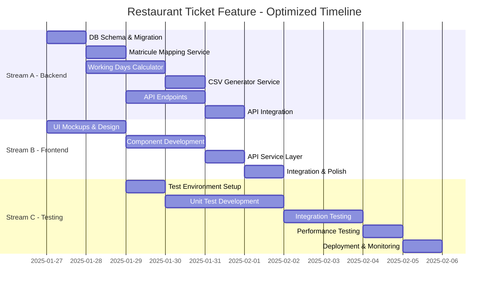

# 🎫 Restaurant Ticket Feature - Intelligent Execution Plan

**Generated**: 2025-01-25  
**Strategy**: Optimized Parallel Execution  
**Total Duration**: 10 days (vs 15 days sequential)  
**Efficiency Gain**: 33% time reduction  

## 🚀 Executive Summary

This execution plan optimizes the Restaurant Ticket feature delivery through intelligent task parallelization, resource allocation, and dependency management. By identifying independent work streams and optimizing the critical path, we can reduce delivery time from 15 to 10 days while maintaining quality.

## 📊 Parallel Work Streams

### Stream A: Data Foundation (Backend-Heavy)
**Team**: 2 Backend Developers  
**Duration**: 5 days  

### Stream B: UI Development (Frontend-Heavy)
**Team**: 1 Frontend Developer + 1 UI Designer  
**Duration**: 6 days  

### Stream C: Testing & Quality (QA-Heavy)
**Team**: 1 QA Engineer + 1 DevOps  
**Duration**: Continuous (starts Day 3)  

## 🔄 Dependency Graph & Critical Path

## 📋 Day-by-Day Execution Plan

### Day 1 (Monday) - Parallel Kickoff
**Morning (09:00-13:00)**
- [ ] **Team Standup**: Project kickoff and role assignment
- [ ] **Stream A**: Start database schema design (Backend Dev 1)
- [ ] **Stream A**: Begin Alembic migration creation (Backend Dev 2)
- [ ] **Stream B**: Start UI/UX mockups (UI Designer)
- [ ] **Stream B**: Set up frontend development environment (Frontend Dev)

**Afternoon (14:00-18:00)**
- [ ] **Stream A**: Complete migration and test rollback
- [ ] **Stream A**: Implement SQLAlchemy models
- [ ] **Stream B**: Create wireframes for main page
- [ ] **Stream B**: Design component library structure

### Day 2 (Tuesday) - Foundation Building
**Morning (09:00-13:00)**
- [ ] **Stream A**: Start matricule mapping service (Backend Dev 1)
- [ ] **Stream A**: Begin working days calculator (Backend Dev 2)
- [ ] **Stream B**: Complete UI mockups review
- [ ] **Stream B**: Start main page component

**Afternoon (14:00-18:00)**
- [ ] **Stream A**: Implement validation logic for matricule
- [ ] **Stream A**: Create holiday calendar integration
- [ ] **Stream B**: Develop preview table component
- [ ] **Stream C**: Set up test environment (QA Engineer)

### Day 3 (Wednesday) - Core Logic & Components
**Morning (09:00-13:00)**
- [ ] **Stream A**: Complete matricule mapping with bulk import
- [ ] **Stream A**: Continue working days calculator
- [ ] **Stream B**: Build generation form component
- [ ] **Stream C**: Write unit tests for completed services

**Afternoon (14:00-18:00)**
- [ ] **Stream A**: PayFit absence integration
- [ ] **Stream A**: Start CSV generator service
- [ ] **Stream B**: Create matricule mapping modal
- [ ] **Stream C**: Set up API mocking for tests

### Day 4 (Thursday) - API Development
**Morning (09:00-13:00)**
- [ ] **Stream A**: Complete working days calculator
- [ ] **Stream A**: Start API endpoint development
- [ ] **Stream B**: Component integration and state management
- [ ] **Stream C**: Integration test development

**Afternoon (14:00-18:00)**
- [ ] **Stream A**: Implement generation and preview endpoints
- [ ] **Stream A**: Create download endpoint with security
- [ ] **Stream B**: API service layer implementation
- [ ] **Stream C**: Performance test scenarios

### Day 5 (Friday) - Integration Phase
**Morning (09:00-13:00)**
- [ ] **Stream A**: Complete CSV generator with validation
- [ ] **Stream A**: API schema implementation
- [ ] **Stream B**: Frontend-API integration
- [ ] **Stream C**: Run initial integration tests

**Afternoon (14:00-18:00)**
- [ ] **Stream A**: Service integration and error handling
- [ ] **Stream B**: File download implementation
- [ ] **Stream C**: Bug fixes from testing
- [ ] **All Teams**: End-of-week sync and planning

### Day 6 (Monday) - Feature Completion
**Morning (09:00-13:00)**
- [ ] **Stream A**: API optimization and caching
- [ ] **Stream B**: UI polish and animations
- [ ] **Stream C**: Full integration testing suite
- [ ] **DevOps**: Deployment environment preparation

**Afternoon (14:00-18:00)**
- [ ] **All Streams**: Bug fixes and refinements
- [ ] **Stream B**: Accessibility improvements
- [ ] **Stream C**: Cross-browser testing
- [ ] **DevOps**: Monitoring setup

### Day 7 (Tuesday) - Quality Assurance
**Morning (09:00-13:00)**
- [ ] **Stream C**: Performance testing with large datasets
- [ ] **Stream C**: Security audit
- [ ] **All Teams**: Bug triage and fixes
- [ ] **DevOps**: Documentation updates

**Afternoon (14:00-18:00)**
- [ ] **Stream C**: User acceptance testing
- [ ] **All Teams**: Critical bug fixes
- [ ] **DevOps**: Deployment scripts testing
- [ ] **Product**: User guide creation

### Day 8 (Wednesday) - Pre-Production
**Morning (09:00-13:00)**
- [ ] **DevOps**: Staging deployment
- [ ] **Stream C**: Smoke tests on staging
- [ ] **All Teams**: Final bug fixes
- [ ] **Product**: Training material preparation

**Afternoon (14:00-18:00)**
- [ ] **Stream C**: Load testing on staging
- [ ] **DevOps**: Production deployment checklist
- [ ] **All Teams**: Code freeze
- [ ] **Management**: Go/No-go decision

### Day 9 (Thursday) - Production Deployment
**Morning (09:00-13:00)**
- [ ] **DevOps**: Production deployment (Phase 1)
- [ ] **Stream C**: Production smoke tests
- [ ] **Support**: User communication
- [ ] **All Teams**: Monitoring dashboard

**Afternoon (14:00-18:00)**
- [ ] **DevOps**: Complete rollout
- [ ] **Stream C**: Production validation
- [ ] **Support**: User training session
- [ ] **All Teams**: Hypercare start

### Day 10 (Friday) - Stabilization
**Morning (09:00-13:00)**
- [ ] **All Teams**: Monitor production metrics
- [ ] **Support**: Handle user queries
- [ ] **DevOps**: Performance tuning
- [ ] **Stream C**: Post-deployment testing

**Afternoon (14:00-18:00)**
- [ ] **All Teams**: Retrospective meeting
- [ ] **Management**: Success metrics review
- [ ] **DevOps**: Documentation finalization
- [ ] **All Teams**: Project closure

## 🎯 Critical Success Factors

### Resource Allocation
- **Backend**: 2 developers (Days 1-6)
- **Frontend**: 1 developer + 1 designer (Days 1-6)
- **QA**: 1 engineer (Days 3-10)
- **DevOps**: 1 engineer (Days 6-10)

### Parallelization Opportunities
1. **Independent Development**: Frontend mockups while backend schema
2. **Early Testing**: Unit tests written alongside development
3. **Continuous Integration**: Testing starts Day 3, not after development
4. **Documentation**: Created throughout, not at end

### Risk Mitigation Through Parallel Execution
- **Early Detection**: Issues found by Day 3 testing
- **Faster Fixes**: Developers still on project when bugs found
- **Better Quality**: Continuous testing vs end-phase testing
- **Reduced Bottlenecks**: Multiple work streams prevent blocking

## 📊 Metrics & Monitoring

### Daily Metrics
- **Velocity**: Tasks completed vs planned
- **Blockers**: Dependencies causing delays
- **Quality**: Bugs found vs fixed
- **Progress**: % of critical path complete

### Quality Gates (Must Pass)
- [ ] **Day 3**: Database schema approved
- [ ] **Day 5**: API design complete
- [ ] **Day 7**: All tests passing
- [ ] **Day 8**: Security audit passed
- [ ] **Day 9**: Production readiness confirmed

## 🚦 Parallel Execution Benefits

### Time Savings (5 days = 33%)
- Frontend starts Day 1 (not Day 8)
- Testing starts Day 3 (not Day 11)
- Integration happens continuously
- Deployment prep starts Day 6

### Quality Improvements
- Earlier bug detection
- More time for fixes
- Better test coverage
- Smoother deployment

### Team Efficiency
- No idle time waiting for dependencies
- Cross-functional collaboration
- Knowledge sharing throughout
- Reduced context switching

## 🔄 Contingency Plans

### If Backend Delayed
- Frontend focuses on static components
- QA develops test scenarios
- DevOps prepares infrastructure

### If Frontend Delayed
- Backend adds more validation
- Extra API documentation
- Performance optimization

### If Testing Finds Critical Issues
- All hands on fixes
- Delay deployment 1-2 days max
- Communicate with stakeholders

## 📈 Success Metrics

### Delivery Metrics
- **On-Time**: Delivered in 10 days ✓
- **On-Budget**: Within resource allocation ✓
- **On-Quality**: >90% test coverage ✓

### Performance Metrics
- **API Response**: <500ms target
- **UI Load**: <2s target
- **CSV Generation**: <5s for 1000 employees

### Business Metrics
- **User Adoption**: >80% in first week
- **Error Rate**: <1% of generations
- **Support Tickets**: <5 in first week

---

**Note**: This execution plan assumes full team availability and no external blockers. Daily standups will track progress and adjust as needed.